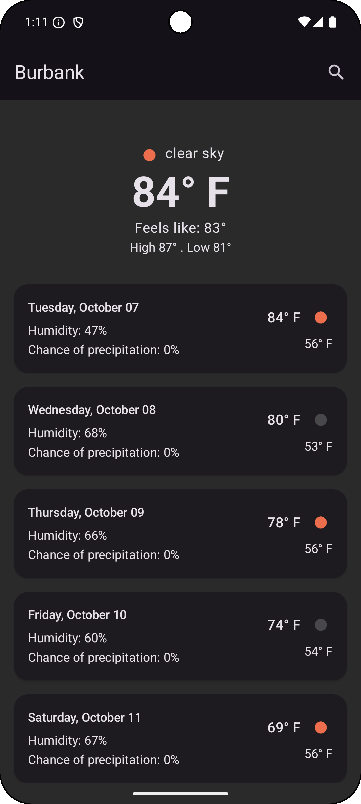
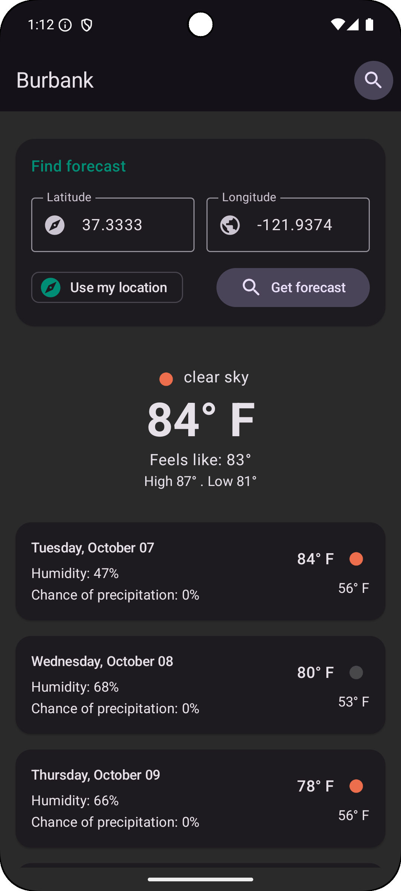
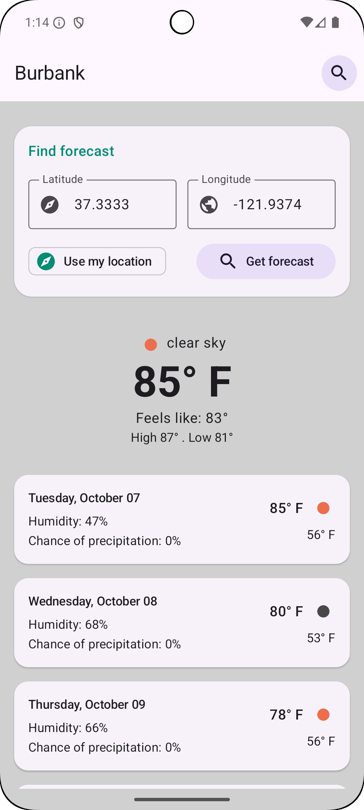

# Weather App

This is a sample weather application for Android.

## Project Structure

The project is structured as follows:

```
weather/
├── app/ # Main application module
├── core/ # Core modules with shared functionalities
│   ├── common/
│   ├── data/
│   ├── designsystem/
│   ├── location/
│   ├── model/
│   ├── network/
│   └── testing/
├── feature/ # Feature modules
│   └── home/
└──
```

## Architecture Overview

This project follows the MVVM (Model-View-ViewModel) pattern combined with Clean Architecture principles to ensure separation of concerns and maintainability. The architecture consists of three main layers:

- **Presentation Layer:** Responsible for UI and user interaction. It includes Compose UI components and ViewModels that expose state to the UI.
- **Domain Layer:** Contains business logic and use cases, orchestrating data flow between the presentation and data layers.
- **Data Layer:** Handles data retrieval and storage, including networking, caching, and data source implementations.

## Module Descriptions

- **core/common:** Contains shared utilities, extensions, and helper functions used across the app.
- **core/data:** Implements data sources, repositories, and data mapping logic to provide data to the domain layer.
- **core/designsystem:** Defines the app's UI design system including theming, typography, colors, and reusable Compose components.
- **core/location:** Provides location services and APIs to access device location data.
- **core/model:** Defines the data models and domain entities used throughout the app.
- **core/network:** Manages network communication including Retrofit interfaces, API clients, and network-related utilities.
- **core/testing:** Contains shared testing utilities, mocks, and helpers for unit and integration tests.
- **feature/home:** Implements the home screen feature including UI, ViewModels, and feature-specific business logic.
- **app:** The main application module that ties all modules together, configures dependency injection, and hosts the app entry point.

## Screenshots

<p align="center">
  
  
  
</p>


## Features

*   Displays the current weather.
*   Shows a daily forecast.
*   Allows the user to search for a city by latitude and longitude.
*   Supports pull-to-refresh to update weather data.
*   Uses the device's current location to show local weather.
*   Implements a Material 3 expressive UI for a modern look and feel.

## Tech Stack

The project leverages modern Android libraries and tools:

*   **Jetpack Compose:** For building declarative and reactive UI.
*   **Dagger Hilt:** Simplifies dependency injection and promotes modularity.
*   **Retrofit:** For efficient and type-safe network communication.
*   **Kotlin Coroutines:** Handles asynchronous programming and concurrency.
*   **Coil:** Loads and caches images efficiently in Compose.
*   **Material 3:** Provides modern UI components and theming capabilities.

## Testing

Testing is an integral part of the project strategy:

*   **Unit Tests:** Located in `core/testing`, these cover business logic, data layers, and utilities.
*   **UI Tests:** Utilize Jetpack Compose Testing APIs to validate UI components and user interactions.

## Build and Run

To build and run the application, you can use Android Studio.

1.  Clone the repository.
2.  Open the project in Android Studio.
3.  Let Gradle sync and download the dependencies.
4.  Run the `app` configuration.

## Dependencies

The project uses the following key dependencies:

*   [Kotlin](https://kotlinlang.org/)
*   [Jetpack Compose](https://developer.android.com/jetpack/compose) for the UI.
*   [Retrofit](https://square.github.io/retrofit/) for networking.
*   [Dagger Hilt](https://dagger.dev/hilt/) for dependency injection.

This is a basic overview of the project. For more details, please refer to the source code.
## Note: The OpenWeather API limits forecast data to 5 days, so the app will display forecasts for only five days.
